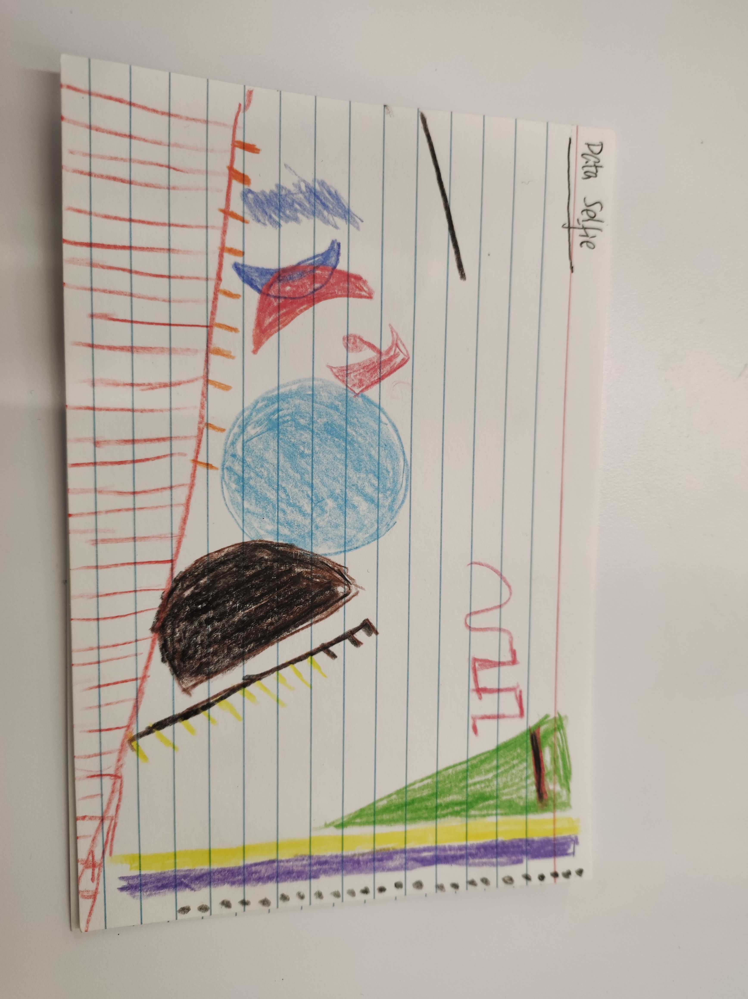

# H1

## Data Selfie

## About Me

Hi, My name is Vincent. I am a second-year MS-Computational Analysis and Public Policy (MS-CAPP) student at the University of Chicago. Previously, I graduated from the University of Minnesota Twin Cities with high distinctions, where I dual-majored in Sociology of law, criminology, and deviance and Statistics. I also earned a minor in Political Science and graudated from the DirecTrack to Teaching program (a teaching prep program at the U). 

I am a crime and K-12 education researcher focusing on policing, juvenile delinquency, decarceration, criminal procedure (Fourth Amendment), and a variety of K12 schooling related topics. As a data science student from a social science background, I consider myself as a mixed-method researcher with demonstrated knowledge, experience, and interest in quantitative, qualitative, community engagement, and writing-based methods. I recently launched my own policy and personal website ([link](https://jcvincentliu.netlify.app)) and am in the progress of publishing my second op-ed with Chicago Policy Review (stay tuned). For a full list of my experiences, you can also see my LinkedIn page ([link](https://www.linkedin.com/in/juncheng-liu-79075315a/)). 

Data journalism/visualization is probably my most interested technical field. This passion starts from those beautiful graphs and inforgraphics that I saw in outlets, such as NYT or Washington Post. Since then, I have been wanting to reproduce and even excel them, and this will led me to this class. Before taking this course, my go-to visualization method is `R ggplot` (`Seaborn` is just not as great as `ggplot`. I am picky on this) for static graphcs and `plotly` or `leaflet` for interactive ones (latter is specifically for interactive maps). It's kinda interesting that I don't really know about Tableau (many people start with Tableau and move to other softwares), although I probably should be more skilled at it for job purposes. But for this quarter, $D_3$, $javascript$, and $css$ are all I care about. I don't learn a new programming language fast, but I am always on the road of learning with my born curiosity. 

I look forward to this jouney. 

*PS: I am so glad that Charmine is the TA. Her works are really fantastic!!!!*