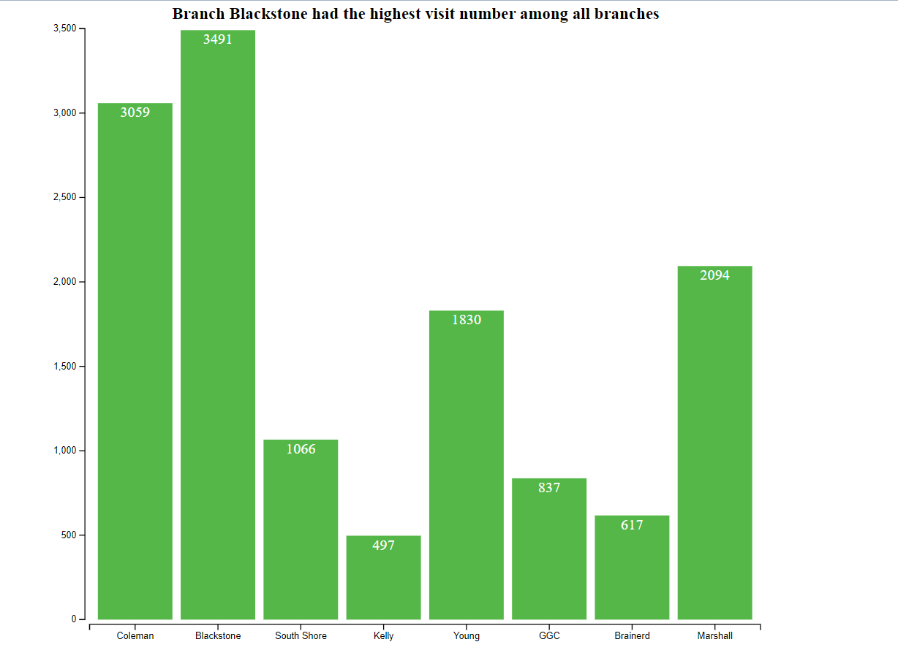

# Visualizing Library Visits Information 

## Description

In this homework, I used $D3.js$ framework to visualize the visiting numbers of library branches surrounding the University of Chicago community. Library visit information was scraped from the City of Chicago Data portal ahead of time and includes the visiting number and zip code of 8 library branches in or near the Hyde Park area as represented by their zip codes. A bar chart is selected as the format to make visualization happen, which directly shows the quantity in the most direct, compelling, yet beautiufl way. 

## Direction

- **homework.js**: the javascript file that produces the visualization using the $d3.j3$ library 
- **homework.html**: the html document that defines the page layout and settings
- **library_visits_jan22**: the dataset in csv
- **README.md**: this file
- **d3_bar_chart.png**: the saved graph

## Findings:

Branch Blackstone was the most popular branch on 1/22 with 3491 people visiting. This is closely followed by branch Coleman, which also had 3k+ visiting number. By Contrasts, branches Kelly, GCC, and Brainerd were not that popular.  