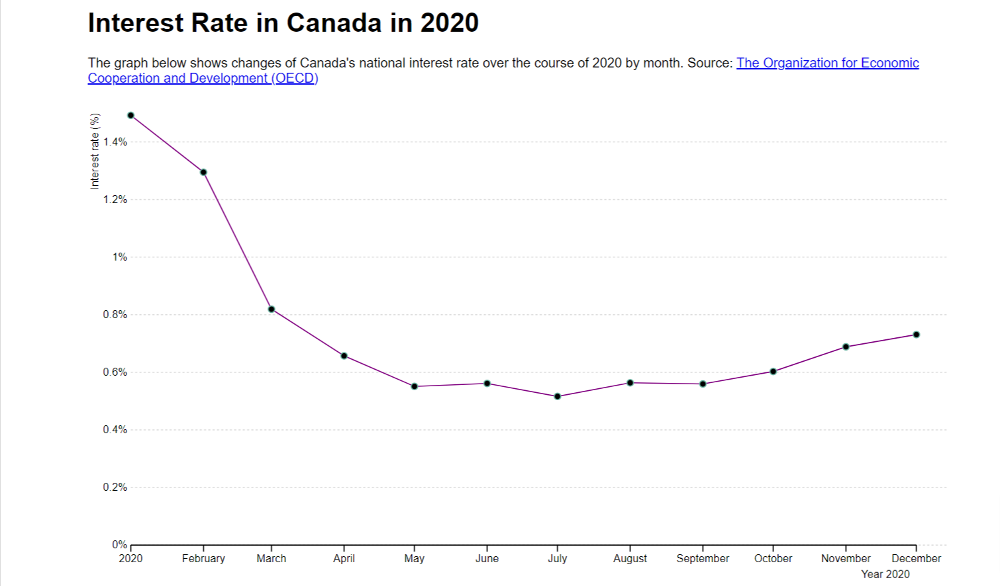

# Visualizing Canada's Interest Rate Change in 2020

## What it is

In this exercise, I am trying to use `d3.js` framework to visualize how Canada's interest rate changed over the course of 2020. To make my goal meet, I've downloaded the data from the OECD website and wrote my codes in `homework.html` and `homework.js`. 

## What it looks like

## Problems:

- Interactivity is off: I tried to learn from this [D3 tutorial](https://d3-graph-gallery.com/graph/connectedscatter_tooltip.html), but the code is kinda weird
- Reformatting X axis ticks is not successful: I want to make ticks sth like "Jan", "Feb", .... (see line 42, 43 in `homework.js`)